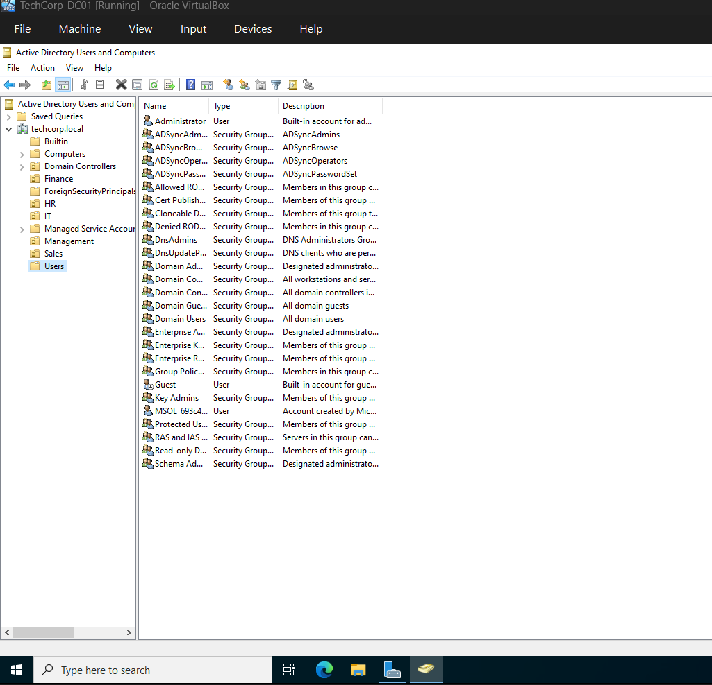
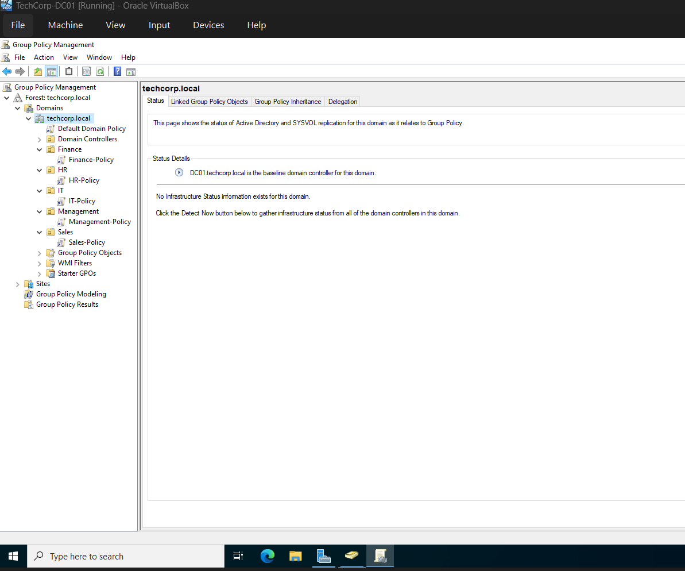
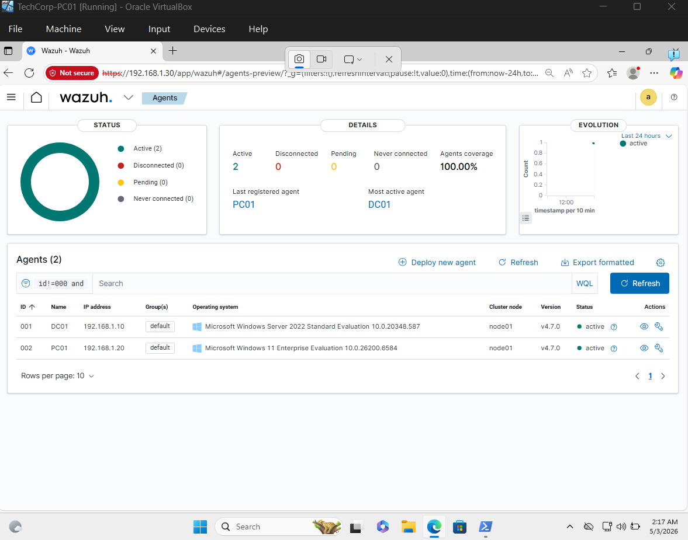
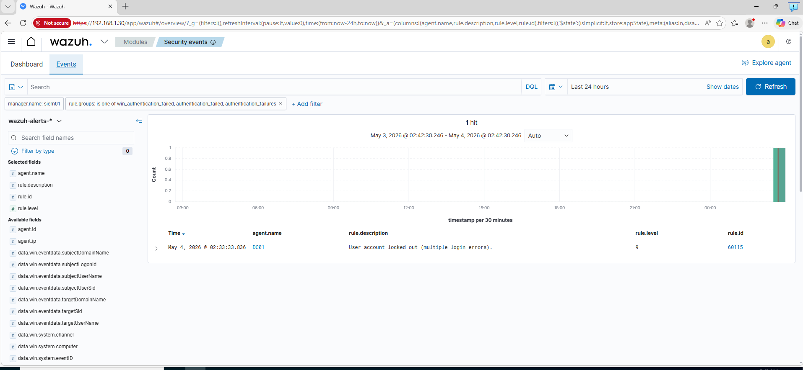
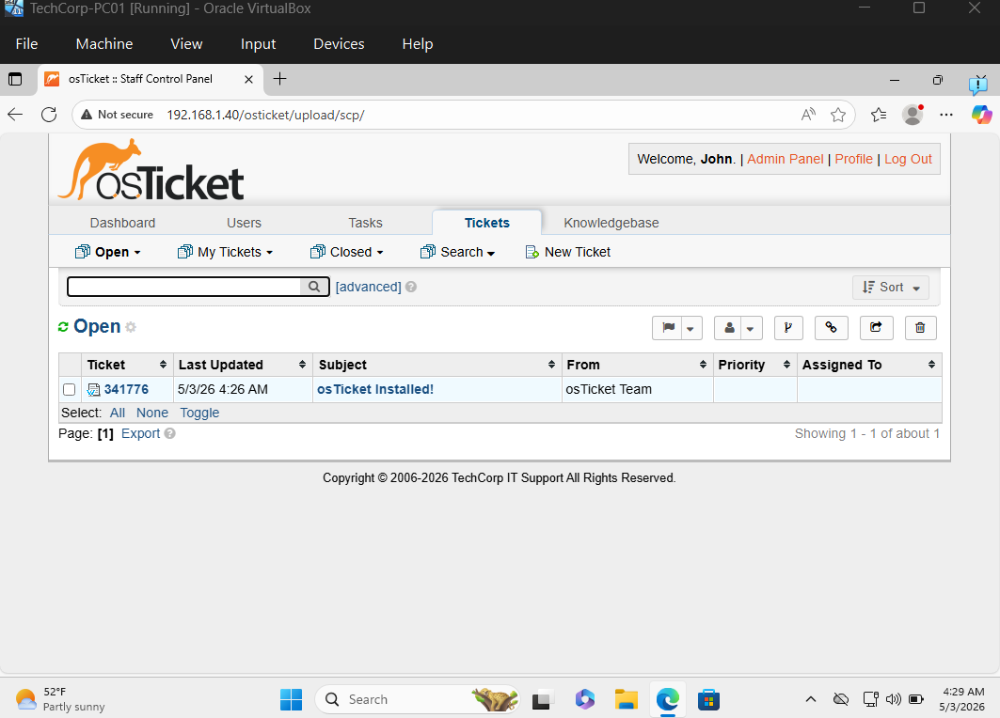
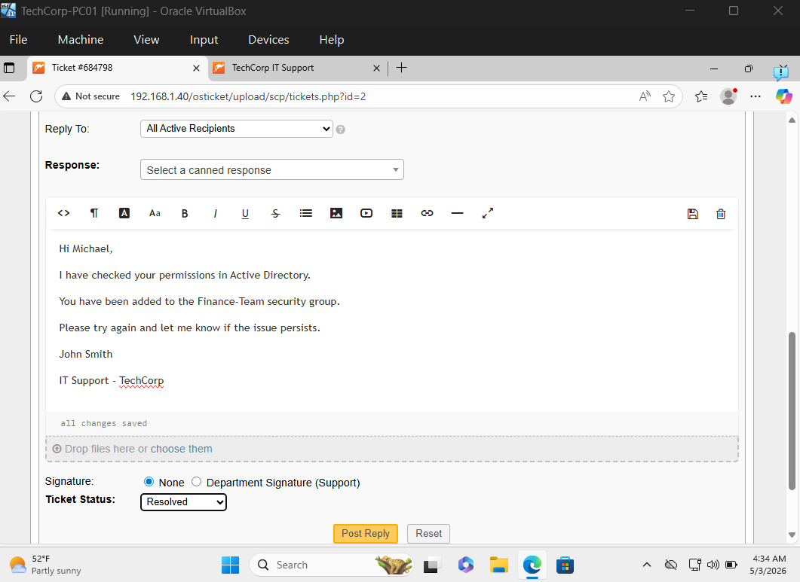
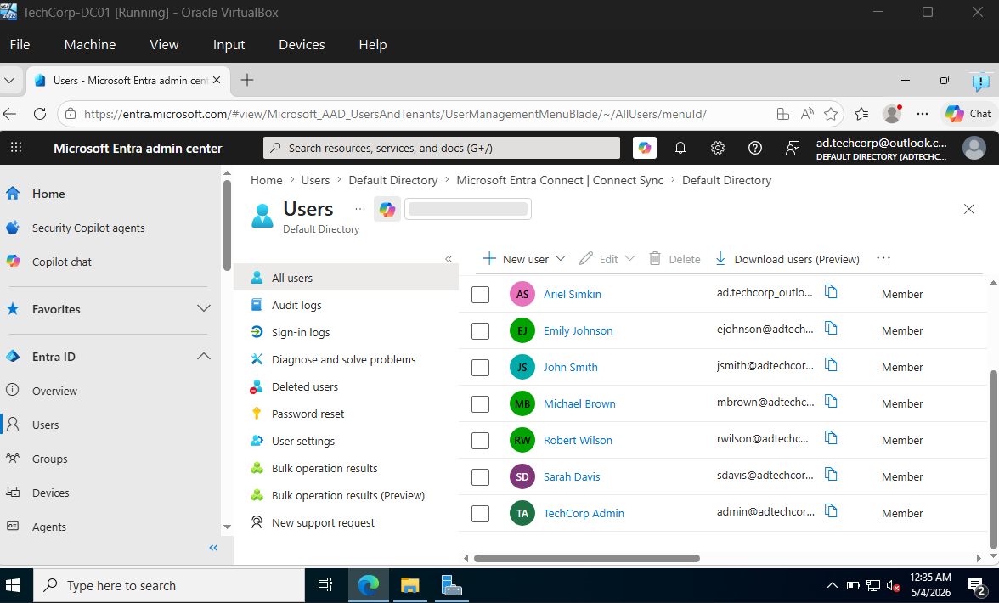
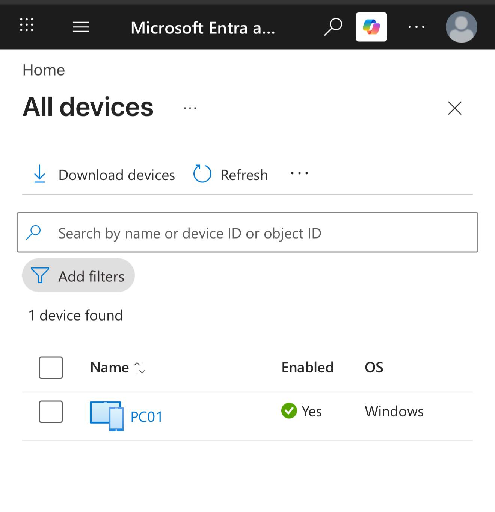
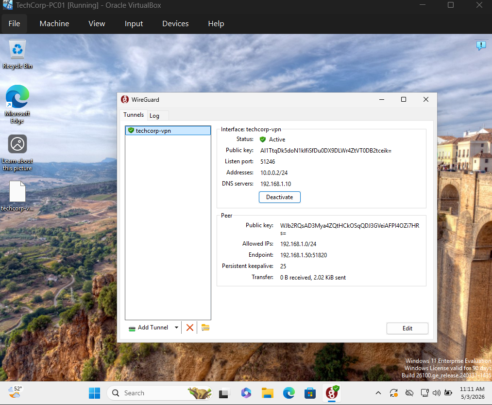
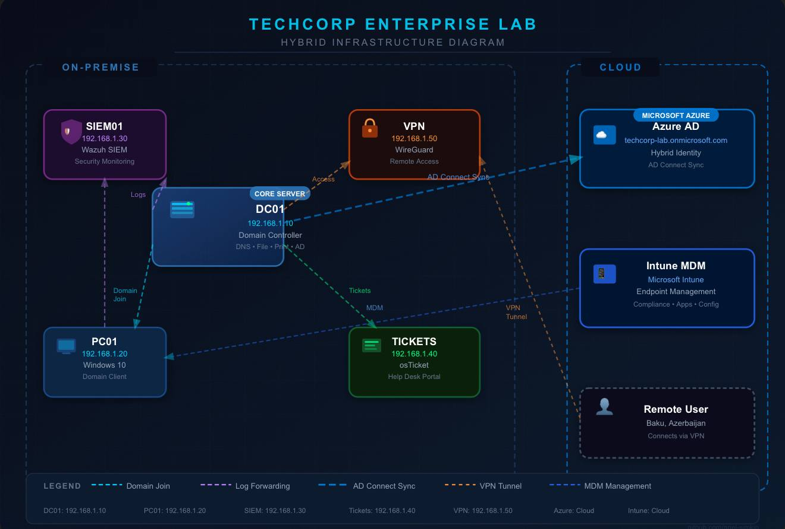

# TechCorp AD Lab 🏢

A fully automated Active Directory home lab simulating a real SMB environment.
Built with Windows Server 2022 and PowerShell.

## Lab Architecture

| Machine | IP | Role |
|---------|-----|------|
| DC01 | 192.168.1.10 | Domain Controller, DNS, File & Print Server |
| PC01 | 192.168.1.20 | Windows 10 Client - joined to domain |
| SIEM01 | 192.168.1.30 | Wazuh Security Monitoring |
| Tickets | 192.168.1.40 | osTicket Help Desk |
| VPN | 192.168.1.50 | WireGuard Remote Access |
| Intune | Cloud | MDM Endpoint Management |
| Azure AD | Cloud | Hybrid Identity + Cloud Sync |

## Scripts

| Script | Description |
|--------|-------------|
| ad-setup.ps1 | Creates OUs, users and groups |
| fileprint-setup.ps1 | Creates shared folders and printers |
| gpo-setup.ps1 | Applies Group Policy settings |

## What This Lab Covers

- Active Directory Domain (Windows Server 2022)
- Organizational Units: IT, HR, Finance, Sales, Management
- Users and Security Groups per department
- File Server with shared folders per department
- Print Server with virtual printers
- Group Policy Objects (GPOs) for security
- Wazuh SIEM for security monitoring
- osTicket Help Desk ticketing system
- WireGuard VPN for remote access
- Azure AD Connect for hybrid identity
- Microsoft Intune for endpoint management
- PowerShell automation for all deployment tasks

## Security Policies Applied

| Policy | Target |
|--------|--------|
| Password complexity + 90-day expiry | All users |
| Screen lock after 10 minutes | IT department |
| USB storage disabled | Finance department |

## Skills Demonstrated

Active Directory · PowerShell · Group Policy · Windows Server 2022
Azure AD · Microsoft Intune · Wazuh SIEM · WireGuard VPN
osTicket · File Server · Print Server · Hybrid Identity

## Troubleshooting & Lessons Learned

---

*   No internet on Ubuntu VMs
    *   Cause: Default route was missing.
    *   Solution: Executed sudo ip route add default via 192.168.0.1 dev enp0s8.

*   Wazuh login failed
    *   Cause: Special characters in the password caused authentication issues.
    *   Solution: Reset the password using the wazuh-passwords-tool.sh utility.

*   WireGuard UI blocked
    *   Cause: The current user was not part of the local administrators group.
    *   Solution: Added the user using net localgroup Administrators [user] /add.

*   Azure AD Connect failed
    *   Cause: ProtonMail addresses are not supported for this configuration.
    *   Solution: Switched to an @outlook.com account to complete the sync.

---

## Hybrid Cloud Integration

*   Microsoft Intune: Fully configured for MDM (Mobile Device Management) to enforce security policies on endpoints.
*   Endpoint Enrollment: PC01 is successfully joined to the domain and enrolled in Azure AD, enabling seamless Single Sign-On (SSO) and cloud management.

## Screenshots

### Active Directory

### Wazuh SIEM

### osTicket Help Desk

### Azure AD

### WireGuard VPN

### Network

